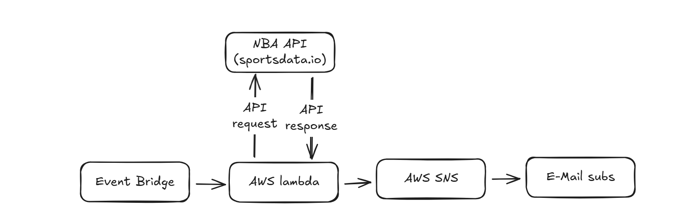

NBA Game Day Alert System

A real-time NBA score notification system built on AWS. Users receive live game updates via Email or SMS every 10 minutes. Even on days with no games, the system notifies users with a “No games today” message.GE

EventBridge → Lambda → SportsDataIO API → Process Data → SNS → User (Email/SMS)

Features

Live NBA Scores: Fetches current game scores and statuses from SportsDataIO API.

Automatic Notifications: Sends updates to users via AWS SNS.

Scheduled Updates: Runs every 10 minutes using AWS EventBridge.

No Games Message: Sends a default message if no games are scheduled.

Technologies

AWS Lambda – Serverless function to fetch and process NBA data.

AWS SNS – Notification service for Email and SMS delivery.

AWS EventBridge – Scheduler for periodic Lambda execution.

Python – Lambda function programming language.

SportsDataIO API – Source for live NBA scores.

Example Notification

Game Day: “Lakers 102 – 98 Celtics, 4th Quarter”

No Game Day: “No games today”